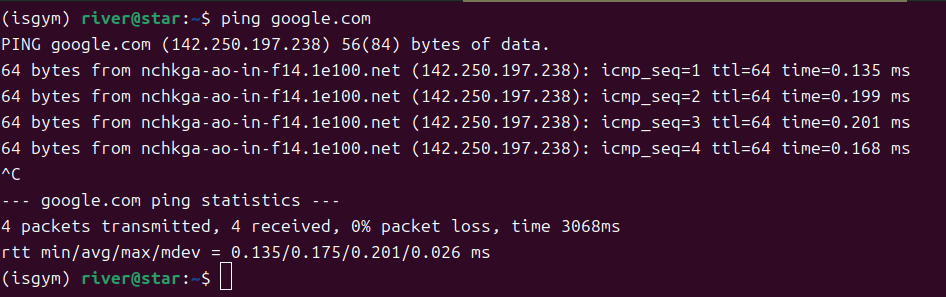

## 代理软件

* hiddify：https://github.com/hiddify/hiddify-app/releases
* 使用方法：

1. 导入代理订阅链接
2. 点击下面的Hiddify连接
3. 选择节点
4. 不要选择系统代理，要么仅代理，要么VPN

## 安全配置

1. DNS选择DoH，
   1. 远程：https://cloudflare-dns.com/dns-query
   2. 本地：https://223.5.5.5/dns-query

2. 连接选择混合端口
3. sudo 启动，选择VPN模式：

4. 路由选项

### 1. 解析目标地址（Resolve Target Address）

- **作用**：此选项用于指定 Hiddify 在处理流量时如何解析目标地址。通常，这意味着 Hiddify 会将目标域名解析为 IP 地址，以便能够正确地转发流量。
- **使用场景**：在某些情况下，用户可能希望手动指定解析的目标地址，或者使用特定的 DNS 服务器进行解析，以确保流量能够正确路由。

### 2. 绕过局域网（Bypass LAN）

- **作用**：启用此选项后，Hiddify 将不通过代理转发局域网内的流量。这意味着在访问局域网设备（如打印机、文件共享服务器等）时，流量将直接发送到局域网，而不是通过 Hiddify 的代理。
- **使用场景**：适合需要访问局域网资源的用户，确保在使用代理的同时仍然能够访问本地网络设备。

### 3. 阻止广告（Block Ads）

- **作用**：此选项用于启用广告拦截功能，Hiddify 将会阻止通过代理转发的流量中的广告请求。这通常是通过使用特定的广告过滤规则或列表来实现的。
- **使用场景**：适合希望减少广告干扰、提高浏览体验的用户。启用此选项后，用户在浏览网页时会看到更少的广告内容。

5. WARP——选择通过代理连接WARP

