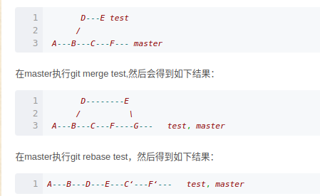
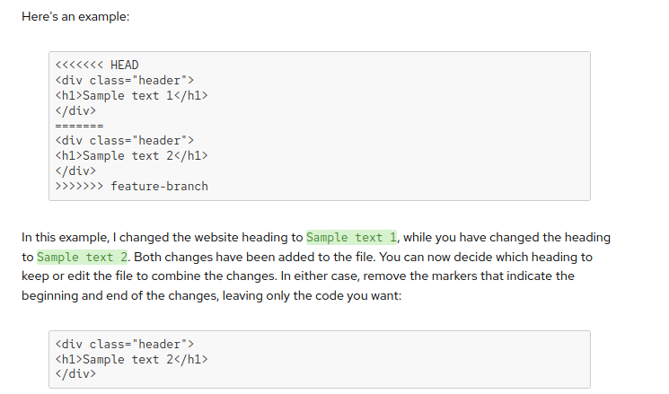

# upload repository

* generate keys

```bash
ssh-keygen -t  rsa -f /path/to/key/name/without/suffix
# default
cat ~/.ssh/id_rsa.pub
# if setting keyfile's location
cat /path/to/key/name/without/suffix.pub
```

* 将密钥添加到ssh-agent中，这样重装也能用

```bash
eval "(ssh-agent -s)"
# 添加密钥
ssh-add  /path/to/key/name/without/suffix
# list out& delete
ssh-add -l
ssh-add -d /path/to/key/name/without/suffix
```

* choose github界面的ssh login/upload

* push to server

```bash
git push origin main
```

## remote: error: GH007: Your push would publish a private email address.

[link](https://stackoverflow.com/questions/43863522/error-your-push-would-publish-a-private-email-address)

- local email address不要设置得和github email addressx相同
  
  ```bash
  git config --global user.email "{ID}+{username}@users.noreply.github.com"
  ```
  
  ```bash
  git commit --amend --reset-author --no-edit
  ```

## change default branch

- Setting/Repositories/branch

# delete commit points

[link](https://stackoverflow.com/questions/1338728/how-do-i-delete-a-commit-from-a-branch)

## Method 1:

```bash
git stash
git reset --hard branch_id
git stash pop/apply
git add .
git commit -m "illustration"
```

## Method 2:

```bash
git rebase -i branch_id
```

* 配置编辑器
  
  ```bash
  git config --global core.editor "code --wait"  # 使用 VS Code
  git config --global core.editor "vim"   # 使用 vim
  git config --global core.editor "nano"  # 使用 nano
  ```

* 在git.rebase-todo文件中，保留需要的分支，删除不要的，close即可

# push to private server

## first push

* 本机仓库添加服务器addr

```python
git remote remove server
git remote add server  ssh://chenlei@10.15.82.118:10022/home/chenlei/IsaacLab/.git
```

* 注意服务器上，先建立~/IsaacLab空目录，之后直接`git init`的分支是"master"
  
  要切换分支

```python
git checkout main
```

* 本机执行推送

```bash
git push server main
```

```bash
枚举对象中: 24377, 完成.
对象计数中: 100% (24377/24377), 完成.
使用 16 个线程进行压缩
压缩对象中: 100% (8602/8602), 完成.
写入对象中: 100% (24377/24377), 37.84 MiB | 9.50 MiB/s, 完成.
总共 24377（差异 14260），复用 23935（差异 13996），包复用 0
remote: Resolving deltas: 100% (14260/14260), done.
To ssh://10.15.82.118:10022/home/chenlei/IsaacLab/.git
 * [new branch]          main -> main
```

## push/pull前的处理

* 暂存

```bash
git stash
```

* 丢弃

```bash
git stash drop
```

* 恢复

```bash
git stash apply
```

## later push

* 之后的推送可能遇到如下问题

```bash
Git push error '[remote rejected] master -> master (branch is currently checked out)'
```

https://stackoverflow.com/questions/2816369/git-push-error-remote-rejected-master-master-branch-is-currently-checked

* 解决办法
1. 服务器设为中央仓库，接受推送

```bash
git  config  --bool  core.bare true
```

2. 推送代码

```bash
git push server main
```

3. 关闭中央 仓库，来进行git reset, git add ., git commit等操作

```bash
git config --bool core.bare true
```

4. 需要推到服务器的时候服务器再次设为中央仓库即可～

### ps

* 有时，可能需要推送本地分支的最新提交到远程分支

```bash
git push origin HEAD:main
```

* 同理，推送某个分支

```bash
git push origin local_branch:remote_branch
```

## bare_repo

https://stackoverflow.com/questions/2816369/git-push-error-remote-rejected-master-master-branch-is-currently-checked

# pull合并分支

## rebase

```bash
git checkout feature
git rebase master
```


* merge操作会生成一个新的节点，之前的提交分开显示。  

* 而rebase操作不会生成新的节点，是将两个分支融合成一个线性的提交。



# pull rebase

- 变基是把远程分支当作当前分支的initial?

> 变基是一种将一个分支的更改“移动”到另一个分支的顶部的操作。它的主要目的是使项目历史更加线性和清晰。
> 
> #### 工作原理：
> 
> - 当您执行变基时，Git 会将当前分支的所有提交“摘下”，然后将目标分支的最新提交应用到当前分支上，最后再将当前分支的提交逐个应用到目标分支的顶部。
> - 变基会改变提交的历史，因此在公共分支上使用变基时需要小心，以避免影响其他开发者的工作。

* 变基后，系统处于本地分支，但本地分支在远程分支的基前

[git pull --rebase的正确使用很明显此时远程分支有新的 commit 未同步到本地，无法推送。正常情况下我 - 掘金](https://juejin.cn/post/6844903895160881166)

```bash
$ git pull origin main
来自 github.com:isaac-sim/IsaacLab
 * branch                  main       -> FETCH_HEAD
提示：您有偏离的分支，需要指定如何调和它们。您可以在执行下一次
提示：pull 操作之前执行下面一条命令来抑制本消息：
提示：
提示：  git config pull.rebase false  # 合并（缺省策略）
提示：  git config pull.rebase true   # 变基
提示：  git config pull.ff only       # 仅快进
提示：
提示：您可以将 "git config" 替换为 "git config --global" 以便为所有仓库设置
提示：缺省的配置项。您也可以在每次执行 pull 命令时添加 --rebase、--no-rebase，
提示：或者 --ff-only 参数覆盖缺省设置。
```

* 合并

```bash
git pull origin main --no-rebase
```

* 冲突信息如下

```bash
git pull origin main
来自 github.com:isaac-sim/IsaacLab
 * branch                  main       -> FETCH_HEAD
自动合并 scripts/reinforcement_learning/rsl_rl/play.py
冲突（内容）：合并冲突于 scripts/reinforcement_learning/rsl_rl/play.py
自动合并 scripts/reinforcement_learning/rsl_rl/train.py
自动合并 scripts/tutorials/03_envs/create_quadruped_base_env.py
自动合并 source/isaaclab/isaaclab/managers/action_manager.py
自动合并 source/isaaclab/isaaclab/managers/reward_manager.py
自动合并 source/isaaclab/isaaclab/terrains/terrain_importer.py
冲突（内容）：合并冲突于 source/isaaclab/isaaclab/terrains/terrain_importer.py
自动合并 source/isaaclab_rl/isaaclab_rl/rsl_rl/__init__.py
冲突（内容）：合并冲突于 source/isaaclab_rl/isaaclab_rl/rsl_rl/__init__.py
自动合并 source/isaaclab_rl/isaaclab_rl/rsl_rl/exporter.py
自动合并 source/isaaclab_rl/isaaclab_rl/rsl_rl/rl_cfg.py
冲突（内容）：合并冲突于 source/isaaclab_rl/isaaclab_rl/rsl_rl/rl_cfg.py
自动合并 source/isaaclab_rl/isaaclab_rl/rsl_rl/vecenv_wrapper.py
自动合并失败，修正冲突然后提交修正的结果。
```

* 修正冲突信息



* 提交

```bash
git add .
git commit -m "fix conflicts"
```

# submodule

* 链接：[Git: submodule 子模块简明教程 | A Quest After Perspectives](https://iphysresearch.github.io/blog/post/programing/git/git_submodule/)

* Geek: https://www.geeksforgeeks.org/how-to-use-the-git-submodule-init-and-update-command/

* clone远程仓库到本地文件夹

```bash
git submodule add https://github.com/iphysresearch/GWToolkit.git GWToolkit
```

* 老版拉取

```bash
git submodule update --init --recursive
```

* 查看

```bash
git status
```


* sub module也需要initialization

```bash
git submodule init
```
