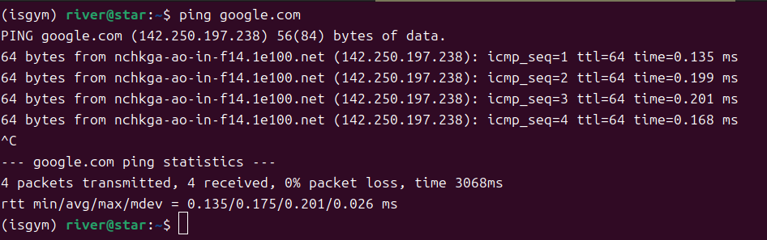

# hiddify
* https://github.com/hiddify/hiddify-app/releases
## 使用方法：
1. 从第一次连接开始,就sudo用VPN
2. 导入代理订阅链接
3. 点击下面的Hiddify连接
4. 选择节点
*  不要选择系统代理，要么仅代理，要么VPN

## 安全配置
1. DNS选择DoH，
   1. 远程：https://cloudflare-dns.com/dns-query
   2. 本地：https://223.5.5.5/dns-query
2. 连接选择混合端口



3. 路由选项

### 1. 解析目标地址（Resolve Target Address）

- **作用**：此选项用于指定 Hiddify 在处理流量时如何解析目标地址。通常，这意味着 Hiddify 会将目标域名解析为 IP 地址，以便能够正确地转发流量。
- **使用场景**：在某些情况下，用户可能希望手动指定解析的目标地址，或者使用特定的 DNS 服务器进行解析，以确保流量能够正确路由。

### 2. 绕过局域网（Bypass LAN）

- **作用**：启用此选项后，Hiddify 将不通过代理转发局域网内的流量。这意味着在访问局域网设备（如打印机、文件共享服务器等）时，流量将直接发送到局域网，而不是通过 Hiddify 的代理。
- **使用场景**：适合需要访问局域网资源的用户，确保在使用代理的同时仍然能够访问本地网络设备。

### 3. 阻止广告（Block Ads）

- **作用**：此选项用于启用广告拦截功能，Hiddify 将会阻止通过代理转发的流量中的广告请求。这通常是通过使用特定的广告过滤规则或列表来实现的。
- **使用场景**：适合希望减少广告干扰、提高浏览体验的用户。启用此选项后，用户在浏览网页时会看到更少的广告内容。

5. WARP——选择通过代理连接WARP

# xmind software
* main page: https://xmind.app/download/
* download link: https://xmind.app/desktop/thank-you-for-downloading/?download=linux_deb

`vpn-connect` 是 Cisco AnyConnect Secure Mobility Client 的命令行工具。它通常用于连接到 Cisco VPN。这个工具是 Cisco 提供的，专门用于与其 VPN 解决方案进行交互。

如果你想在 Ubuntu 上使用 `vpn-connect`，你需要安装 Cisco AnyConnect 客户端。请注意，Cisco AnyConnect 客户端通常不是通过 Ubuntu 的标准软件包管理器（如 `apt`）直接安装的，而是需要从 Cisco 的官方网站或通过你的组织获取。


# vpn-connect
## 安装 Cisco AnyConnect

1. **获取安装包**：从 Cisco 的官方网站或你的组织获取 Cisco AnyConnect 的安装包。通常是一个 `.tar.gz` 或 `.sh` 文件。

2. **解压和安装**：
   - 如果是 `.tar.gz` 文件，首先解压：
     ```bash
     tar -xvzf anyconnect-linux64-*.tar.gz
     ```
   - 进入解压后的目录：
     ```bash
     cd anyconnect-*
     ```
   - 运行安装脚本：
     ```bash
     sudo ./install.sh
     ```

3. **使用 `vpn-connect`**：安装完成后，你应该能够使用 `vpn-connect` 命令来连接到 VPN。

## 注意事项

- 确保你有适当的权限和许可证来使用 Cisco AnyConnect。
- 安装过程中可能会要求你输入管理员密码。
- 如果你在安装或使用过程中遇到问题，可以查阅 Cisco 的文档或联系你的 IT 支持团队。

# VPN
* 购买VPN需要注册银联账号
## private internet access
link: https://zh.safetydetectives.com/blog/%E6%9C%80%E4%BD%B3%E4%B8%AD%E5%9B%BD-vpn/

## privateVPN
link: https://privatevpn.com/support/getting-started/linux/debian/network-manager-udp-recommended
